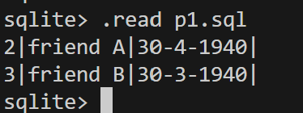

# SQL_learning

[from](https://www.codecademy.com/enrolled/courses/learn-sql)

## 命名
p1.sql: codecademy project  Create a Table
p2.sql: codecademy project  Lyft Trip Data
note.txt: sql筆記

## Result of p1.sql:
